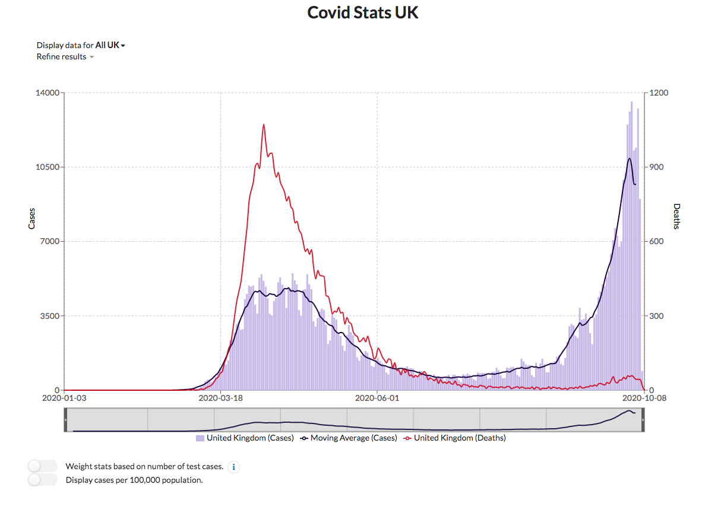

# [Covid Stats UK](https://covidstats.uk)
Website to display stats about Covid cases/deaths in the UK. Hosted at [https://covidstats.uk](https://covidstats.uk).

## Features
* Display cases for UK/Nation/Region/County/Local.
* Aggregates cases from local area to display a total.
* Display deaths for UK/Nation/Region/County.
* Ability to scale cases/deaths per 100,000.
* Display a "worst-case" cases stat by extrapolating the number 
of tests to cases ratio backwards based upon the day of most tests.
* Display an alert level based upon the number of cases over the last 14 days.
* Settings modal to adjust the display.

## Infrastructure

