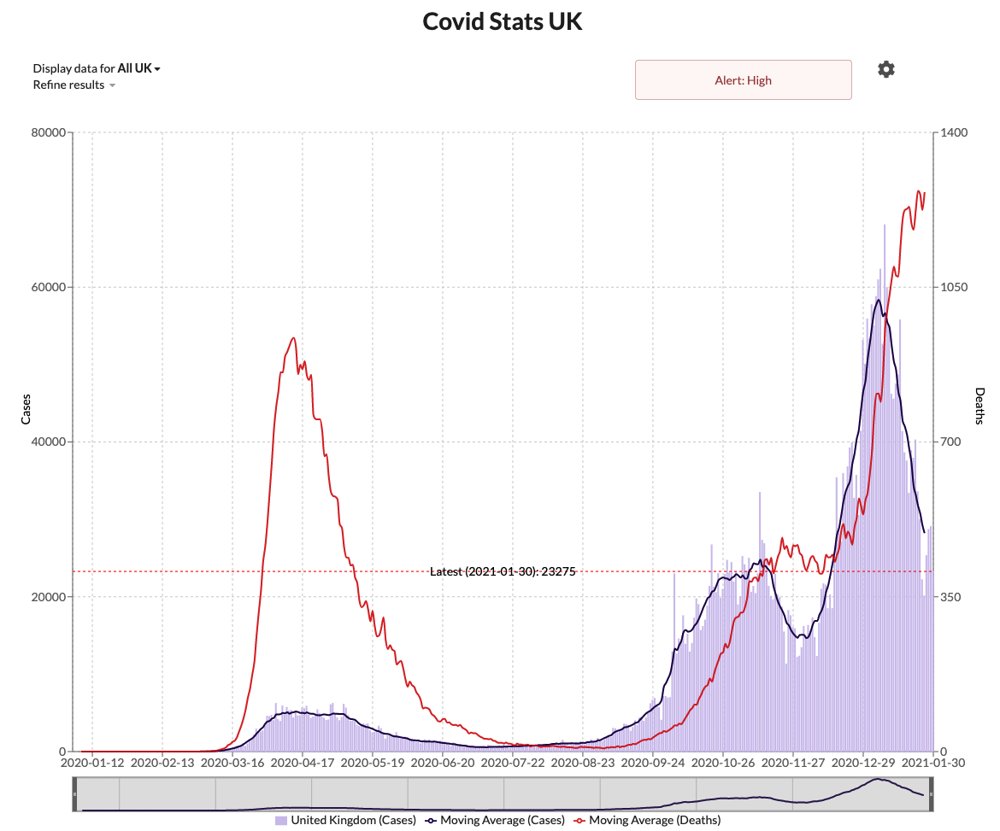

# Covid Stats UK
Website to display stats about Covid cases/deaths in the UK.

## Features
* Display cases for UK/Nation/Region/Local.
* Aggregates cases from local area to display a total.
* Display deaths for UK/Nation/Region.
* Ability to scale cases/deaths per 100,000.
* Display a "worst-case" cases stat by extrapolating the number 
of tests to cases ratio backwards based upon the day of most tests.
